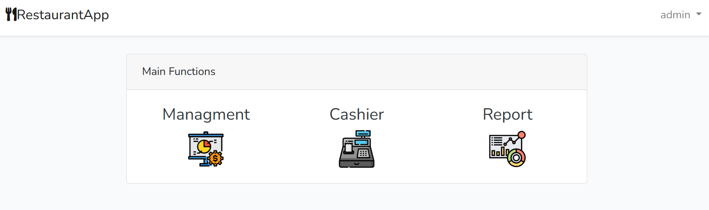
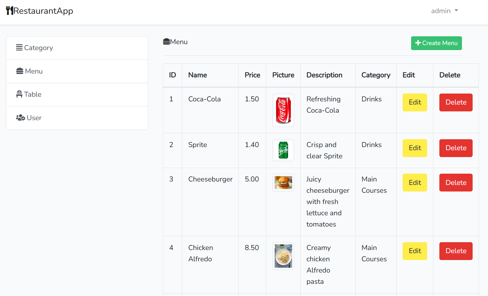
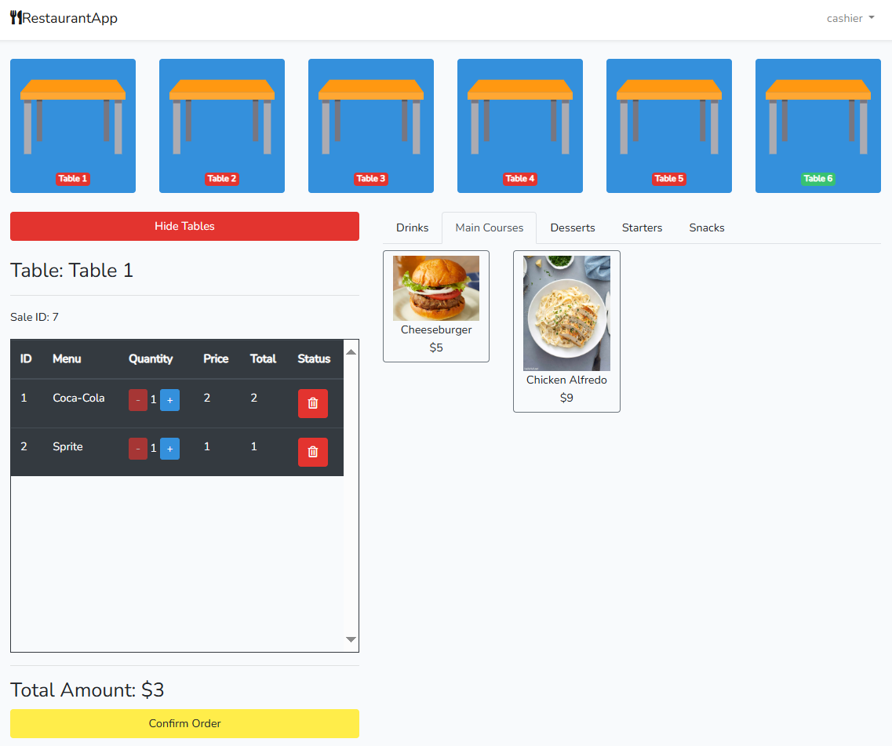
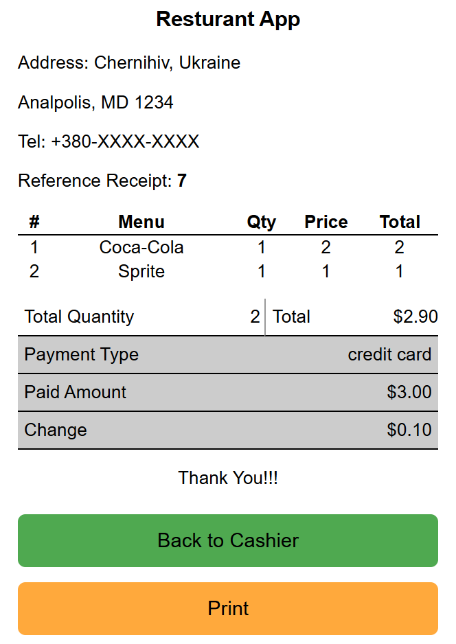
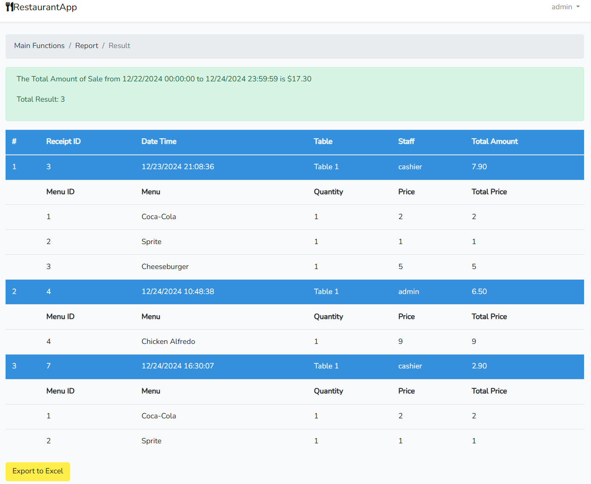

# Laravel CRUD Restaurant


## Project Overview

This project, **Restaurant**, is a restaurant management CRUD application built with Laravel and MySQL. It features modules for managing menus, sales, categories, and reservations using Laravel’s MVC architecture and Eloquent ORM.

### Key Features

- **User Authentication:** Secure login functionality.
- **Management Panel:** CRUD operations for categories, menu items, and tables.
- **Cashier Panel:** Order processing and receipt generation.
- **Reports:** Exportable sales data for analysis.
- **Responsive UI:** Interactive interface built with Laravel Blade.

## Installation Guide

### Prerequisites

1. **Download and Install XAMPP:**

    - Download XAMPP version 7.4.1 for Windows from [SourceForge](https://sourceforge.net/projects/xampp/files/XAMPP%20Windows/7.4.1/).
    - Install XAMPP and start the Apache and MySQL modules from the XAMPP Control Panel.

2. **Composer:**
   Ensure you have Composer installed on your system. Download it from [Composer's official site](https://getcomposer.org/).

3. **Git:**
   Clone the project repository using Git. Install it from [Git's official site](https://git-scm.com/).

4. **Node.js:**
   Install Node.js to manage frontend dependencies. Download it from [Node.js official site](https://nodejs.org/).

### Steps to Set Up

1. **Clone Repository:**

   ```bash
   git clone https://github.com/cerobreath/laravel-crud-restaurant.git
   cd laravel-crud-restaurant
   ```

2. **Install Dependencies:**
   Run the following command to install Laravel dependencies:

   ```bash
   composer install
   ```

   Install Node.js dependencies:

   ```bash
   npm install
   ```

3. **Configure Environment:**
   Update `.env` with your database credentials:

   ```env
   DB_CONNECTION=mysql
   DB_HOST=127.0.0.1
   DB_PORT=3306
   DB_DATABASE=restaurantApplication
   DB_USERNAME=root
   DB_PASSWORD= # Leave blank if no password is set
   ```

4. **Create Database:**

    - Ensure the Apache and MySQL modules are running in XAMPP.
    - Open phpMyAdmin ([http://localhost/phpmyadmin](http://localhost/phpmyadmin)).
    - Create a new database named `restaurantApplication` and ensure the collation is set to `utf8_general_ci`.

5. **Run Migrations:**
   Migrate the database to set up tables and relationships:

   ```bash
   php artisan migrate
   ```

6. **Seed Database (Optional):**
   Populate the database with sample data for testing:

   ```bash
   php artisan db:seed
   ```

7. **Generate Application Key:**

   ```bash
   php artisan key:generate
   ```

### Run the Application

1. Start the Laravel development server:
   ```bash
   php artisan serve
   ```
2. Open your browser and navigate to `http://127.0.0.1:8000`.

## Project Structure

The project follows Laravel’s MVC architecture:

- **Models:** Define database interactions (e.g., `Category`, `MenuItem`).
- **Controllers:** Handle requests and logic (e.g., `CategoryController`, `MenuController`).
- **Views:** Blade templates for UI rendering.
- **Routes:** Defined in `web.php` for user interactions.

## Screenshots

### Login


### Dashboard


### Management


### Cashier


#### Cheque


### Report


## Additional Notes

### Contribution

Feel free to contribute by creating issues or submitting pull requests.

## References

- [Laravel Documentation](https://laravel.com/docs)
- [MySQL Documentation](https://dev.mysql.com/doc/)
